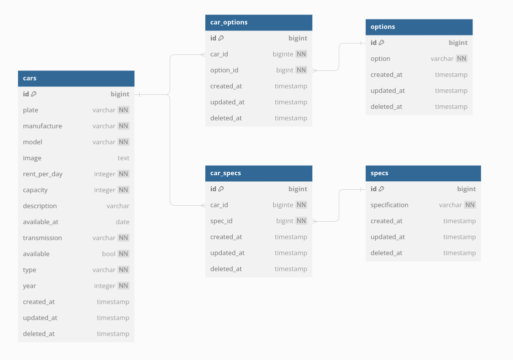

# Car Rental Management API

This API provides endpoints to manage Rental Car data.

## Entity Relationship Diagram (ERD) MANY TO MANY

## Let's get started

1. FIRST, clone this repo > `$ git clone https://github.com/blackjac7/24001085-km6-feb-challenge-ch4.git`
2. SECOND, change dir to repo dir > `$cd 24001085-km6-feb-challenge-ch4`
3. AND LASTLY, install the packages > `$npm install`

Run it with nodemon (npm run dev) or others.

> if you want to check, visit [http://localhost:4000](http://localhost:4000 "http://localhost:4000")

## API Endpoints (dont forget use /api before that)

### Cars

| Route               | HTTP Method | Description               |
| :------------------ | :---------- | :------------------------ |
| `/cars`             | `GET`       | Get all cars              |
| `/cars/:id`         | `GET`       | Get a car by id           |
| `/cars/:id/options` | `GET`       | Get all options for a car |
| `/cars/:id/specs`   | `GET`       | Get all specs for a car   |
| `/cars`             | `POST`      | Create a new car          |
| `/cars/:id`         | `PUT`       | Update a car              |
| `/cars/:id`         | `DELETE`    | Delete a car              |

### Options

| Route          | HTTP Method | Description         |
| :------------- | :---------- | :------------------ |
| `/options`     | `GET`       | Get all options     |
| `/options/:id` | `GET`       | Get an option by id |
| `/options`     | `POST`      | Create a new option |
| `/options/:id` | `PUT`       | Update an option    |
| `/options/:id` | `DELETE`    | Delete an option    |

### Specs

| Route        | HTTP Method | Description       |
| :----------- | :---------- | :---------------- |
| `/specs`     | `GET`       | Get all specs     |
| `/specs/:id` | `GET`       | Get a spec by id  |
| `/specs`     | `POST`      | Create a new spec |
| `/specs/:id` | `PUT`       | Update a spec     |
| `/specs/:id` | `DELETE`    | Delete a spec     |

### Car Options

| Route              | HTTP Method | Description             |
| :----------------- | :---------- | :---------------------- |
| `/car_options`     | `GET`       | Get all car options     |
| `/car_options/:id` | `GET`       | Get a car option by id  |
| `/car_options`     | `POST`      | Create a new car option |
| `/car_options/:id` | `PUT`       | Update a car option     |
| `/car_options/:id` | `DELETE`    | Delete a car option     |

### Car Specs

| Route            | HTTP Method | Description           |
| :--------------- | :---------- | :-------------------- |
| `/car_specs`     | `GET`       | Get all car specs     |
| `/car_specs/:id` | `GET`       | Get a car spec by id  |
| `/car_specs`     | `POST`      | Create a new car spec |
| `/car_specs/:id` | `PUT`       | Update a car spec     |
| `/car_specs/:id` | `DELETE`    | Delete a car spec     |
